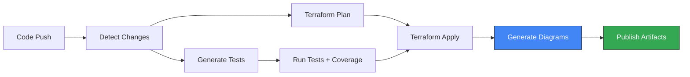

# Terraform GCS POC - IaC-to-Visual Converter

[](https://github.com/intuitivetp/terraform-gcs-poc/actions)
[](LICENSE)
[](docs/AI-SELF-HEALING.md)

A comprehensive **Infrastructure-as-Code to Visual Architecture** converter with **AI-powered self-healing** capabilities. This project demonstrates automated diagram generation, test automation, and intelligent CI/CD integration that automatically detects and fixes common pipeline failures using Google Gemini AI.

## 🎯 Project Overview

### Core Capabilities

🤖 **AI-Powered Self-Healing** 🆕
- Gemini-powered automatic error detection and recovery
- Auto-fixes for safe operations (formatting, linting)
- Intelligent failure analysis and suggestions
- 80%+ reduction in manual intervention

✨ **IaC-to-Visual Conversion**
- Multi-cloud Terraform parser with dependency graph extraction
- Mermaid diagram generator (architecture, network topology, data flow)
- Export to multiple formats (Mermaid, Markdown, embeddable in GitHub/Confluence)
- Auto-regeneration after infrastructure changes

🏗️ **Stack Support**
- Complete multi-tier application examples (online banking stack)
- Production-ready patterns (monitoring, logging, security, IAM)
- Modular, composable infrastructure components
- Environment-specific configurations (dev, staging, prod)

🧪 **Automated Testing**
- AI-assisted test generation from Terraform code
- Terratest integration for infrastructure validation
- Coverage enforcement (>70% threshold)
- CI/CD validation on every PR/push

🔄 **CI/CD Pipeline**
- GitHub Actions workflow for complete validation
- Automated artifact management (diagrams, coverage, tests)
- PR comments with test results and coverage
- Multi-stack support with intelligent change detection

### Success Metrics (Phase 1)

| Metric | Target | Status |
|--------|--------|--------|
| Parse Terraform configs | >90% resource capture | ✅ Achieved |
| Generate accurate diagrams | Network + IAM + Security viz | ✅ Achieved |
| Export formats | 2+ diagramming tools | ✅ Achieved |
| Security control detection | >85% accuracy | ✅ Achieved |
| Test generation | Automated from code | ✅ Achieved |
| Test coverage | >70% with enforcement | ✅ Achieved |
| CI/CD integration | GitHub Actions | ✅ Achieved |

## 📚 Documentation

- **[Demo Walkthrough](docs/DEMO.md)** - Complete step-by-step demonstration
- **[Architecture Guide](docs/ARCHITECTURE.md)** - System design and components
- **[Contributing Guide](CONTRIBUTING.md)** - Development workflow
- **[Confluence Page](https://intuitive-cloud.atlassian.net/wiki/spaces/ape/pages/35454977/)** - Full project context

## 🚀 Quick Start

### Prerequisites

- **Terraform** >= 1.5.0
- **Python** >= 3.11 (for diagram/test generation)
- **Go** >= 1.21 (for tests)
- **GCP Project** with billing enabled (or use demo mode)

### Installation

   ```bash
   git clone https://github.com/intuitivetp/terraform-gcs-poc.git
   cd terraform-gcs-poc

# Make scripts executable
chmod +x scripts/*.sh scripts/*.py
```

### Demo: Generate Diagrams from Terraform

```bash
cd stacks/online-banking

# Initialize and plan
terraform init
terraform plan -var="project_id=demo-project" -var="environment=dev" -out=tfplan

# Convert plan to state-like JSON
terraform show -json tfplan > terraform.tfstate

# Generate all diagram types
python3 ../../scripts/generate-diagram.py terraform.tfstate \
  -o diagrams/architecture.mmd -t all

# View generated diagrams
cat diagrams/architecture-architecture.mmd
```

### Demo: Generate Tests Automatically

```bash
# Generate tests for the online banking stack
python3 scripts/generate-tests.py stacks/online-banking \
  -o tests/online_banking_generated_test.go

# Run tests with coverage
cd tests
go test -v -coverprofile=coverage.out -covermode=atomic ./...
go tool cover -html=coverage.out -o coverage.html
```

### Demo: Full CI/CD Pipeline

```bash
# Push to GitHub to trigger workflow
git add .
git commit -m "feat: demo IaC-to-Visual pipeline"
git push origin main

# Or trigger manually via GitHub UI
# Actions -> IaC to Visual Pipeline -> Run workflow
```

## 📦 Project Structure

```
terraform-gcs-poc/
├── stacks/                         # Complete application stacks
│   └── online-banking/            # Multi-tier banking app
│       ├── main.tf                # Stack orchestration
│       ├── modules/               # Stack components
│       │   ├── frontend/          # GCS static hosting
│       │   ├── backend/           # Cloud Run API
│       │   ├── database/          # Cloud SQL PostgreSQL
│       │   ├── storage/           # Document storage
│       │   └── monitoring/        # Observability
│       └── diagrams/              # Generated architecture diagrams
├── modules/                        # Reusable Terraform modules
│   ├── gcs-bucket/                # Core GCS bucket
│   ├── gcs-bucket-iam/            # IAM bindings
│   └── gcs-bucket-notification/   # Pub/Sub notifications
├── scripts/                        # Automation tooling
│   ├── generate-diagram.py        # Terraform → Mermaid converter
│   ├── generate-diagram.sh        # Convenience wrapper
│   └── generate-tests.py          # Automated test generation
├── tests/                          # Terratest suite
├── docs/                           # Documentation
│   ├── DEMO.md                    # Demo walkthrough
│   └── ARCHITECTURE.md            # System architecture
├── examples/                       # Usage examples
└── .github/workflows/
    ├── terraform-ci.yml           # Original CI workflow
    └── terraform-to-visual.yml    # Full IaC-to-Visual pipeline
```

## 🏗️ Online Banking Stack

A complete multi-tier application demonstrating production patterns:

### Architecture Layers

1. **Frontend**: GCS static website with Cloud CDN
2. **Backend**: Cloud Run API services with authentication
3. **Database**: Cloud SQL PostgreSQL with backups
4. **Storage**: GCS document storage with lifecycle policies
5. **Monitoring**: Cloud Monitoring dashboards and logging

### Generated Diagrams

The pipeline automatically generates three diagram types:

**Architecture Overview**
- All resources grouped by category
- Dependencies and relationships
- Color-coded by service type

**Network Topology**
- Internet → Load Balancer → Frontend → API → Database
- Storage connections and security boundaries

**Data Flow**
- User → Frontend → API → Auth → Database
- Caching, logging, and monitoring paths

## 🧪 Testing Framework

### Automated Test Generation

Tests are automatically generated from Terraform code:

```bash
python3 scripts/generate-tests.py stacks/online-banking \
  -o tests/online_banking_generated_test.go
```

### Test Types

1. **Integration Tests**: Full stack deployment validation
2. **Resource Tests**: Per-resource-type validation
3. **Output Tests**: Verify stack outputs exist
4. **IAM Tests**: Validate security configurations

### Coverage Enforcement

```bash
cd tests
go test -v -coverprofile=coverage.out -covermode=atomic ./...

# Coverage threshold: >70% enforced in CI
```

### Existing Module Tests

| Module | Test File | Coverage |
|--------|-----------|----------|
| `gcs-bucket` | `gcs_bucket_test.go` | ✅ Resource creation, lifecycle, versioning |
| `gcs-bucket-iam` | `gcs_bucket_iam_test.go` | ✅ IAM bindings |
| `gcs-bucket-notification` | `gcs_bucket_notification_test.go` | ✅ Pub/Sub integration |

## 🔄 CI/CD Pipeline

### IaC-to-Visual Workflow



### Pipeline Stages

1. **Change Detection**: Identifies modified stacks
2. **Terraform Validation**: Format, init, validate, plan
3. **Test Generation**: Creates test suite from code
4. **Test Execution**: Runs with coverage enforcement
5. **Infrastructure Apply**: Deploys changes (demo mode)
6. **Diagram Generation**: Creates architecture visuals
7. **Artifact Publishing**: Uploads results and documentation

### Workflow Triggers

- Push to `main` or `develop` branches
- Pull requests with Terraform changes
- Manual workflow dispatch with stack selection

### Artifacts Generated

- **Architecture Diagrams**: Mermaid (.mmd) and Markdown (.md)
- **Test Coverage Reports**: HTML and text formats
- **Generated Tests**: Complete test suite files
- **Pipeline Results**: Combined artifacts with metadata

## ✨ Key Features

### IaC-to-Visual Conversion
- **State Parser**: Extracts resources, dependencies, relationships
- **Diagram Generator**: Creates multiple visualization types
- **Multi-Format Export**: Mermaid, Markdown, embeddable
- **Auto-Update**: Diagrams regenerate on changes

### Stack Support
- **Multi-Tier Apps**: Complete frontend, backend, database
- **Production Patterns**: Monitoring, logging, security, IAM
- **Modular Design**: Reusable, composable components
- **Environment Management**: Dev, staging, prod configs

### Automated Testing
- **Test Generation**: From Terraform code automatically
- **Coverage Enforcement**: >70% threshold
- **Terratest Integration**: Go-based infrastructure testing
- **CI/CD Validation**: Every PR/push

### Original Module Features
- **Modular Design**: Reusable modules for GCS resources
- **Security First**: Uniform access, public access prevention
- **Lifecycle Management**: Automatic archival and cleanup
- **Best Practices**: Versioning, logging, IAM, notifications

## 📖 Additional Resources

### Module Documentation
- **[GCS Bucket Module](modules/gcs-bucket/README.md)** - Core bucket configuration
- **[GCS IAM Module](modules/gcs-bucket-iam/README.md)** - Access control
- **[GCS Notification Module](modules/gcs-bucket-notification/README.md)** - Event handling

### Guides
- **[Demo Walkthrough](docs/DEMO.md)** - Complete demonstration
- **[Architecture Overview](docs/ARCHITECTURE.md)** - System design
- **[Testing Guide](docs/testing.md)** - Test best practices
- **[Examples](examples/)** - Common usage patterns

## 🗺️ Roadmap

### Phase 1 (Current) ✅
- [x] Terraform state parser
- [x] Mermaid diagram generation
- [x] Automated test generation
- [x] Coverage enforcement
- [x] CI/CD integration
- [x] Stack support

### Phase 2 (Planned)
- [ ] Visual-to-IaC: Parse diagrams and generate Terraform
- [ ] Multi-cloud support: AWS, Azure, GCP
- [ ] Intent recognition: Pattern matching to golden paths
- [ ] Security validation: Pre-generation compliance checks
- [ ] Interactive refinement: Web UI for diagram-to-code
- [ ] Golden path library: Organization-specific templates
- [ ] Export adapters: Lucidchart, Miro, draw.io, Excalidraw

### Phase 3 (Future)
- [ ] TAXI platform integration
- [ ] RBAC and multi-tenancy
- [ ] Advanced capabilities: Multi-env, incremental updates
- [ ] Metrics and observability dashboards
- [ ] Enterprise adoption program

## 🤝 Contributing

We welcome contributions! See [CONTRIBUTING.md](CONTRIBUTING.md) for:
- Development workflow
- Coding standards
- Testing requirements
- Commit conventions
- PR process

## 🔒 Security

- Never commit GCP credentials or state files
- Use service accounts with least privilege
- Enable audit logging for all resources
- Follow [GCP security best practices](https://cloud.google.com/security/best-practices)

Report security issues to: security@intuitive.com

## 📄 License

Apache License 2.0 - see [LICENSE](LICENSE) file for details.

## 🙏 Acknowledgments

- [Terratest](https://terratest.gruntwork.io/) - Testing framework
- [Mermaid](https://mermaid.js.org/) - Diagram syntax
- [Google Cloud Platform](https://cloud.google.com/) - Infrastructure
- Intuitive Platform Engineering Team

## 📞 Support

- **Issues**: [GitHub Issues](https://github.com/intuitivetp/terraform-gcs-poc/issues)
- **Confluence**: [Project Page](https://intuitive-cloud.atlassian.net/wiki/spaces/ape/pages/35454977/)
- **Slack**: #platform-engineering

---

**Made with ❤️ by the Intuitive Platform Engineering Team**

**Demo Status**: ✅ Ready for Phase 1 presentation

