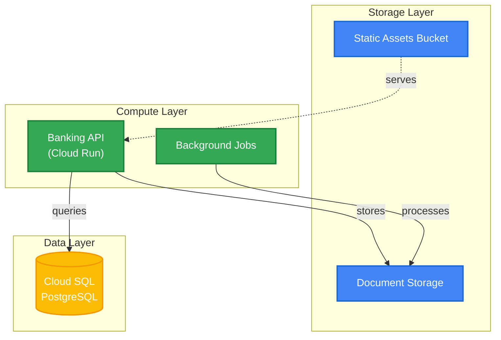

# Terraform GCS POC – IaC-to-Visual Converter

[](https://github.com/intuitivetp/terraform-gcs-poc/actions/workflows/iac-to-visual-ai.yml)
[](LICENSE)
[](docs/AI-SELF-HEALING.md)

Convert Terraform into living architecture diagrams, autogenerated tests, and CI-powered documentation. This proof of concept demonstrates AI-assisted remediation inside a fully automated GitHub workflow.



## Highlights
- Terraform state parser feeds Mermaid diagrams for architecture, network, and data-flow views.
- Python tooling synthesizes Terratest suites and keeps coverage above 70% in CI.
- GitHub Actions pipeline stitches validation, testing, mock/real applies, and artifact publishing together.
- Gemini-powered self-healing fixes safe issues (formatting, obvious syntax errors) and annotates anything requiring manual follow-up.

## Quick Start
- Prerequisites: Terraform ≥ 1.5.0, Python ≥ 3.11, Go ≥ 1.21, Make (optional), and a GCP project if you plan to run real applies.
- Clone and prepare:
  ```bash
  git clone https://github.com/intuitivetp/terraform-gcs-poc.git
  cd terraform-gcs-poc
  chmod +x scripts/*.py scripts/*.sh
  ```
- Run the demo end-to-end: `make demo` (or follow the manual steps in `docs/getting-started.md`).
- Trigger the workflow: push to `main`/`develop` or run **Actions → IaC to Visual Pipeline (AI-Enhanced)**.
- Download the `demo-bundle` artifact from any run to grab diagrams, coverage, and generated tests without reproducing them locally.
- Need a full GCP apply? Dispatch the workflow with `run_real_apply=true` (see `docs/ci-pipeline.md`) after supplying credentials and state bucket secrets.

## Demo & Workflow
- Customer walkthrough: `docs/demo-playbook.md`
- Pipeline architecture and AI hooks: `docs/ci-pipeline.md`
- Self-healing deep dive: `docs/AI-SELF-HEALING.md`

## Sample Stacks
- `stacks/online-banking` – flagship multi-tier retail banking example
- `stacks/wealth-management` – advisory-focused variant with the same automation patterns

## Documentation
- Documentation hub: `docs/README.md`
- Getting started: `docs/getting-started.md`
- Architecture reference: `docs/ARCHITECTURE.md`
- Development standards: `docs/development-guide.md`
- Testing patterns: `docs/testing.md`
- Troubleshooting: `docs/troubleshooting.md`
- Roadmap: `docs/roadmap.md`

## Project Layout
```
terraform-gcs-poc/
├── modules/                  # Reusable Terraform modules (GCS bucket, IAM, notifications)
├── stacks/                   # Demo stacks (online-banking) with generated diagrams
├── scripts/                  # Diagram/test generation utilities
├── tests/                    # Terratest suites and generated files
├── docs/                     # Documentation hub (see docs/README.md)
├── examples/                 # Additional usage samples
└── .github/workflows/        # IaC-to-Visual GitHub Actions workflows
```

## Contributing & Support
- Follow `CONTRIBUTING.md` for coding standards, testing expectations, and PR workflow.
- For issues or feature ideas open a GitHub issue or capture them in `docs/roadmap.md`.
- Need help during a demo? Start with `docs/troubleshooting.md`, then review the latest workflow run artifacts.
