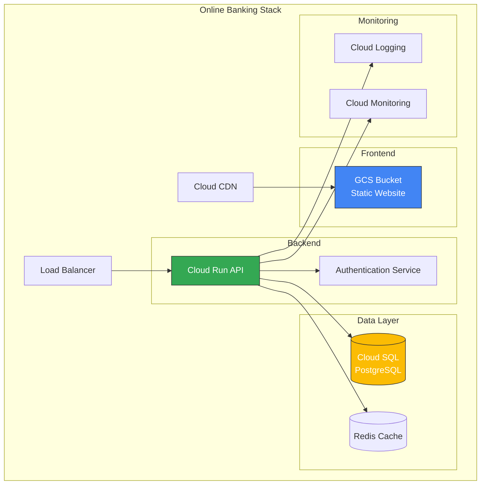

# TODO

This document tracks planned features and improvements for the terraform-gcs-poc project.

## 🎯 High Priority

### Stack Support for Multi-Tier Applications
**Status**: 📋 Planned

Add support for infrastructure stacks that can provision complete application environments.

**Example**: Online Banking Application Stack
- **Frontend**: GCS bucket for static website hosting with CDN
- **Backend**: Cloud Run services or GKE deployment
- **Database**: Cloud SQL or Firestore
- **Additional Services**: 
  - Load balancing
  - Identity/Authentication
  - Monitoring and logging
  - Secrets management

**Implementation Ideas**:
```
stacks/
├── online-banking/
│   ├── main.tf           # Stack orchestration
│   ├── frontend.tf       # Static site + CDN
│   ├── backend.tf        # API services
│   ├── database.tf       # Data persistence
│   ├── networking.tf     # VPC, load balancers
│   └── README.md         # Stack documentation
```

**Benefits**:
- Demonstrate complete infrastructure-as-code patterns
- Show integration between multiple GCP services
- Provide real-world example architectures
- Test cross-service dependencies

**Acceptance Criteria**:
- [ ] Create stack module structure
- [ ] Implement online-banking example stack
- [ ] Add comprehensive tests for stack deployments
- [ ] Document stack patterns and best practices
- [ ] Generate architecture diagram (mermaid)

---

### Test Coverage Automation
**Status**: 📋 Planned

Automatically check test coverage after new tests are created and enforce minimum thresholds.

**Requirements**:
1. **Coverage Reporting**: Generate coverage reports after test runs
2. **Coverage Thresholds**: Enforce minimum 80% coverage
3. **Coverage Trends**: Track coverage changes over time
4. **CI Integration**: Fail builds if coverage drops below threshold

**Implementation Ideas**:

```yaml
# .github/workflows/terraform-ci.yml
- name: Run Tests with Coverage
  run: |
    cd tests
    go test -v -coverprofile=coverage.out -covermode=atomic ./...
    go tool cover -html=coverage.out -o coverage.html

- name: Check Coverage Threshold
  run: |
    COVERAGE=$(go tool cover -func=coverage.out | grep total | awk '{print $3}' | sed 's/%//')
    THRESHOLD=80
    if (( $(echo "$COVERAGE < $THRESHOLD" | bc -l) )); then
      echo "Coverage $COVERAGE% is below threshold $THRESHOLD%"
      exit 1
    fi

- name: Upload Coverage Report
  uses: codecov/codecov-action@v3
  with:
    files: ./tests/coverage.out
```

**Tools to Consider**:
- **codecov.io**: Coverage reporting and tracking
- **coveralls.io**: Alternative coverage service
- **go-coverage-report**: GitHub Action for Go coverage

**Acceptance Criteria**:
- [ ] Add coverage generation to test runs
- [ ] Implement coverage threshold checking in CI
- [ ] Generate HTML coverage reports
- [ ] Upload coverage to external service (optional)
- [ ] Add coverage badge to README
- [ ] Document coverage requirements in CONTRIBUTING.md

---

### JIRA Mock Action for Acceptance Criteria Validation
**Status**: 📋 Planned

Create a GitHub Action that validates implementation against acceptance criteria defined in JIRA tickets.

**Functionality**:
1. **Fetch JIRA Ticket**: Retrieve ticket details via JIRA API
2. **Parse Acceptance Criteria**: Extract criteria from ticket description/custom fields
3. **Run Validation Checks**: Execute checks against criteria
4. **Report Results**: Comment on PR with validation status

**Example Workflow**:

```yaml
# .github/workflows/acceptance-validation.yml
name: Acceptance Criteria Validation

on:
  pull_request:
    types: [opened, synchronize, reopened]

jobs:
  validate-acceptance-criteria:
    runs-on: ubuntu-latest
    steps:
      - uses: actions/checkout@v4
      
      - name: Extract JIRA Issue Key
        id: jira
        run: |
          # Extract from PR title or branch name
          ISSUE_KEY=$(echo "${{ github.event.pull_request.title }}" | grep -oP '[A-Z]+-\d+' || echo "")
          echo "issue_key=$ISSUE_KEY" >> $GITHUB_OUTPUT
      
      - name: Fetch JIRA Acceptance Criteria
        id: criteria
        uses: ./actions/fetch-jira-criteria
        with:
          jira_url: ${{ secrets.JIRA_URL }}
          jira_token: ${{ secrets.JIRA_TOKEN }}
          issue_key: ${{ steps.jira.outputs.issue_key }}
      
      - name: Validate Against Criteria
        id: validate
        run: |
          # Parse criteria and run checks
          # - Check if tests exist
          # - Check if documentation updated
          # - Check if examples added
          # - Custom validation logic
          
      - name: Comment on PR
        uses: actions/github-script@v7
        with:
          script: |
            const results = ${{ steps.validate.outputs.results }};
            github.rest.issues.createComment({
              issue_number: context.issue.number,
              owner: context.repo.owner,
              repo: context.repo.repo,
              body: `## Acceptance Criteria Validation\n\n${results}`
            });
```

**Validation Types**:
- ✅ Tests added for new functionality
- ✅ Documentation updated
- ✅ Examples provided
- ✅ Coverage threshold met
- ✅ Security checks passed
- ✅ Performance benchmarks met (if applicable)

**Acceptance Criteria**:
- [ ] Create custom GitHub Action for JIRA integration
- [ ] Implement criteria parsing logic
- [ ] Add validation check framework
- [ ] Create PR comment formatter
- [ ] Add workflow to check acceptance criteria
- [ ] Document usage in CONTRIBUTING.md
- [ ] Test with real JIRA tickets

---

### Architecture Diagram Generation (Mermaid)
**Status**: 📋 Planned

Automatically generate Mermaid diagrams showing the infrastructure architecture for each stack.

**Features**:
1. **Stack Visualization**: Generate diagram from Terraform code
2. **Resource Relationships**: Show dependencies and connections
3. **Auto-Update**: Regenerate on infrastructure changes
4. **Multiple Views**: Different diagram types (architecture, data flow, network)

**Example Output**:



**Implementation Options**:

**Option 1: terraform-graph + Conversion**
```bash
terraform graph | dot -Tsvg > graph.svg
# Convert to mermaid format
```

**Option 2: Custom Parser**
```python
# scripts/generate-mermaid-diagram.py
import hcl2
import json

def parse_terraform(tf_dir):
    # Parse .tf files
    # Extract resources and dependencies
    # Generate mermaid syntax
    pass

def generate_mermaid(resources, dependencies):
    # Create mermaid graph
    pass
```

**Option 3: GitHub Action**
```yaml
- name: Generate Architecture Diagram
  uses: terraform-docs/gh-actions@v1
  with:
    working-dir: stacks/online-banking
    output-file: ARCHITECTURE.md
    output-method: inject
    config-file: .terraform-docs.yml
```

**File Structure**:
```
stacks/
├── online-banking/
│   ├── main.tf
│   ├── ARCHITECTURE.md       # Generated diagram
│   └── architecture.mmd      # Mermaid source
```

**Acceptance Criteria**:
- [ ] Implement Terraform-to-Mermaid parser
- [ ] Generate architecture diagrams for all stacks
- [ ] Add network topology diagrams
- [ ] Add data flow diagrams
- [ ] Auto-update diagrams in CI/CD
- [ ] Embed diagrams in stack README files
- [ ] Support multiple diagram views
- [ ] Document diagram generation process

---

## 📚 Documentation Improvements

### Additional Topics
- [ ] Add deployment guide for production environments
- [ ] Create cost optimization guide
- [ ] Add security best practices document
- [ ] Create disaster recovery and backup guide

---

## 🧪 Testing Enhancements

### Test Infrastructure
- [ ] Add performance/load testing for bucket operations
- [ ] Implement chaos testing scenarios
- [ ] Add compliance validation tests
- [ ] Create test data generators

---

## 🔧 Tooling

### Development Tools
- [ ] Add pre-commit hooks for Terraform formatting
- [ ] Create local development environment setup script
- [ ] Add Taskfile for common operations
- [ ] Implement automated dependency updates

---

## 🔄 CI/CD Enhancements

### Pipeline Improvements
- [ ] Add automated security scanning (tfsec, checkov)
- [ ] Implement cost estimation in PRs
- [ ] Add drift detection automation
- [ ] Create release automation workflow

---

## 📊 Monitoring & Observability

### Observability Features
- [ ] Add OpenTelemetry instrumentation examples
- [ ] Create monitoring dashboards (Grafana)
- [ ] Implement alerting examples
- [ ] Add log aggregation patterns

---

## 🎓 Educational Content

### Learning Materials
- [ ] Create video tutorials
- [ ] Add interactive examples
- [ ] Write blog posts about patterns
- [ ] Create workshop materials

---

## Contributing

To propose a new TODO item:
1. Open an issue describing the feature/improvement
2. Discuss with the team
3. Add to this document with acceptance criteria
4. Create an epic/user story in JIRA (if applicable)

---

## Priority Legend

- 🔥 **Critical**: Blocking or urgent
- 🎯 **High Priority**: Important for next release
- 📋 **Planned**: Scheduled for future release
- 💡 **Ideas**: Under consideration
- ⏸️ **On Hold**: Deprioritized temporarily
- ✅ **Completed**: Done (move to CHANGELOG)

---

Last Updated: 2025-10-16

