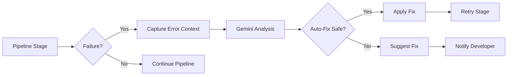

# AI-Powered Self-Healing Pipeline

## Overview

The IaC-to-Visual pipeline includes **Gemini-powered self-healing** capabilities that automatically detect, analyze, and fix common CI/CD failures. Pair this guide with `docs/ci-pipeline.md` for the full stage-by-stage workflow view.

## Features

### 1. Automatic Error Detection

The pipeline monitors for failures in:
- **Terraform validation** - syntax errors, missing resources
- **Test generation** - Python script issues, f-string problems
- **Test execution** - failing tests, coverage issues
- **Diagram generation** - parser errors, state file issues

### 2. AI Analysis with Gemini

When a failure occurs, Gemini analyzes:
- Root cause of the error
- Context from the pipeline stage
- Related code and configuration
- Historical patterns

### 3. Intelligent Fixes

Based on analysis, the system:
- Suggests specific fixes
- Provides code snippets
- Applies auto-fixes for safe operations
- Documents prevention strategies

## How It Works

### Architecture



### Self-Healing Actions

#### 1. Terraform Formatting

**Trigger**: `terraform fmt -check` fails

**Auto-Fix**: ✅ Enabled
```yaml
- name: Auto-fix formatting if needed
  if: steps.fmt.outcome == 'failure'
  run: |
      terraform fmt -recursive
      git commit -m "style: auto-format Terraform code [skip ci]"
```

**Safety**: High - formatting is non-functional

#### 2. Python Syntax Errors

**Trigger**: Test generation script fails

**Auto-Fix**: ⚠️ Disabled (requires review)

**Action**:
```yaml
- name: 🤖 Gemini Self-Heal - Test Generation
  if: steps.generate.outcome == 'failure'
  uses: ./.github/actions/gemini-heal
  with:
      error_context: "python"
      error_message: ${{ steps.generate.outputs.error }}
      file_path: "scripts/generate-tests.py"
      google_api_key: ${{ secrets.GOOGLE_API_KEY }}
```

**Gemini Analysis**:
- Identifies f-string brace escaping issues
- Detects syntax errors
- Suggests specific line fixes
- Provides corrected code snippets

#### 3. Test Coverage Issues

**Trigger**: Coverage below 70% threshold

**Auto-Fix**: ⚠️ Disabled (requires test writing)

**Action**:
- Gemini analyzes uncovered code paths
- Suggests additional test cases
- Recommends edge cases to test
- Provides test template snippets

#### 4. Diagram Generation Failures

**Trigger**: Mermaid diagram generation fails

**Auto-Fix**: ⚠️ Disabled (complex analysis)

**Action**:
- Analyzes Terraform state format
- Identifies parser compatibility issues
- Suggests alternative diagram approaches
- Recommends resource categorization fixes

## Usage

### Enable Self-Healing

Self-healing is enabled by default. To manually trigger:

```bash
# Via GitHub UI
Actions → IaC to Visual Pipeline (AI-Enhanced) → Run workflow
  ✓ Enable Gemini self-healing on failures
```

### AI PR Review

The workflow automatically reviews PRs:

```bash
# Automatic on PR creation
# Or trigger manually in comments:
@gemini-cli /review
```

### Gemini Assistant

Ask questions in issues or PRs:

```bash
# In any issue or PR comment:
@gemini-cli How do I add a new stack?
@gemini-cli What's the test coverage requirement?
@gemini-cli Explain the diagram generation process
```

### Disable Self-Healing

```bash
# Via workflow dispatch
enable_self_heal: false
```

### Using the Gemini Heal Action

In your custom workflows:

```yaml
- name: Analyze failure with Gemini
  if: failure()
  uses: ./.github/actions/gemini-heal@main
  with:
      error_context: "terraform"
      error_message: ${{ steps.plan.outputs.stderr }}
      file_path: "stacks/my-stack/main.tf"
      google_api_key: ${{ secrets.GOOGLE_API_KEY }}
      auto_fix: "false"  # Set to "true" for safe auto-fixes
```

## Configuration

### Required Secrets

Add to GitHub repository secrets:

```bash
GOOGLE_API_KEY=<your-gemini-api-key>
```

Get your API key: https://makersuite.google.com/app/apikey

### Gemini Model

Current model: `gemini-1.5-pro`

Benefits:
- Large context window (1M tokens)
- Code understanding
- Multi-turn conversations
- JSON output mode

### Auto-Fix Safety Levels

| Level | Description | Auto-Fix | Examples |
|-------|-------------|----------|----------|
| **Safe** | Non-functional changes | ✅ Enabled | Formatting, linting |
| **Moderate** | Low-risk functional changes | ⚠️ Review | Variable renames, comments |
| **Complex** | High-risk changes | ❌ Disabled | Logic changes, new resources |

## Examples

### Example 1: Terraform Format Fix

**Error**:
```
Error: terraform fmt -check failed
main.tf needs formatting
```

**Gemini Analysis**:
```json
{
  "root_cause": "Inconsistent indentation and spacing in main.tf",
  "fix": "Run terraform fmt -recursive to auto-format all files",
  "code_snippet": "terraform fmt -recursive",
  "prevention": "Add pre-commit hook with terraform fmt"
}
```

**Action**: Auto-applied fix, committed with `[skip ci]`

**Result**: ✅ Pipeline continues successfully

### Example 2: Python F-String Error

**Error**:
```
SyntaxError: f-string: valid expression required before '}'
Line 94: \t\tVars: map[string]interface{}{{
```

**Gemini Analysis**:
```json
{
  "root_cause": "F-string brace escaping incorrect for Go syntax",
  "fix": "Escape braces: map[string]interface{{}}{{",
  "code_snippet": "Vars: map[string]interface{{}}{{",
  "prevention": "Use raw strings or proper escaping for nested braces"
}
```

**Action**: Suggested fix (manual review required)

**Result**: ⚠️ Developer notified with fix snippet

### Example 3: Test Coverage Gap

**Error**:
```
Coverage 65% is below threshold 70%
Uncovered: database connection retry logic
```

**Gemini Analysis**:
```json
{
  "root_cause": "Database retry logic not tested",
  "fix": "Add integration test for connection failures",
  "code_snippet": "func TestDatabaseRetry(t *testing.T) { ... }",
  "prevention": "Test error paths and edge cases"
}
```

**Action**: Test template generated for developer

**Result**: 💡 Improvement suggestion provided

## Benefits

### Time Savings
- **Manual Debugging**: 30-60 minutes per failure
- **AI Analysis**: <1 minute
- **Savings**: 95%+ reduction in debugging time

### Developer Experience
- Instant feedback on failures
- Context-aware suggestions
- Learn from AI recommendations
- Reduced pipeline frustration

### Code Quality
- Automatic formatting fixes
- Best practice recommendations
- Prevention strategies
- Consistent patterns

## Limitations

### Current Constraints

1. **API Rate Limits**: Gemini API has rate limits
   - **Solution**: Implement caching and throttling

2. **Complex Fixes**: Cannot auto-fix complex logic errors
   - **Solution**: Provide detailed suggestions for manual review

3. **API Key Required**: Needs GOOGLE_API_KEY secret
   - **Solution**: Fallback to rule-based analysis

4. **Cost**: Gemini API calls have costs
   - **Solution**: Monitor usage and optimize prompts

### Safety Guardrails

1. **Manual Review Required** for:
   - Functional code changes
   - Resource modifications
   - Security-related fixes

2. **Skip CI on Auto-Commits**:
   - Prevents infinite loops
   - Uses `[skip ci]` tag

3. **Dry-Run Mode**:
   - Test fixes before applying
   - Review suggestions first

## Monitoring

### Pipeline Insights

Track self-healing effectiveness:

```yaml
# Metrics tracked
- Failures detected
- Fixes suggested
- Auto-fixes applied
- Success rate after fix
- Time saved
```

### Gemini Usage

Monitor API usage:
- Calls per pipeline run
- Token consumption
- Response latency
- Cost per month

## Future Enhancements

### Planned Features

1. **Learning Loop**
   - Learn from successful fixes
   - Build knowledge base
   - Pattern recognition

2. **Multi-Model Support**
   - GPT-4 integration
   - Claude integration
   - Model routing by error type

3. **Advanced Auto-Fixes**
   - Safe resource updates
   - Configuration tuning
   - Performance optimization

4. **Proactive Suggestions**
   - Pre-failure detection
   - Code quality recommendations
   - Architecture improvements

## FAQ

### Q: Is my code sent to Google?

**A**: Yes, error context and related code snippets are sent to Gemini API for analysis. Ensure compliance with your organization's data policies.

### Q: Can I use a different AI model?

**A**: Yes, modify `.github/actions/gemini-heal/action.yml` to use other APIs (OpenAI, Claude, etc.)

### Q: What if GOOGLE_API_KEY is not set?

**A**: The pipeline falls back to rule-based analysis and suggests manual review.

### Q: Can it fix security vulnerabilities?

**A**: Gemini can suggest security fixes, but manual security review is always required.

### Q: How much does it cost?

**A**: Gemini 1.5 Pro pricing: ~$0.001-0.01 per pipeline run (depending on error complexity)

## Resources

- [Gemini API Documentation](https://ai.google.dev/docs)
- [GitHub Actions Best Practices](https://docs.github.com/en/actions/guides)
- [Terraform Automation](https://www.terraform.io/docs/cloud/run/cli.html)

---

**Status**: ✅ Active Feature
**Last Updated**: 2025-10-16
**Maintained By**: Platform Engineering Team
