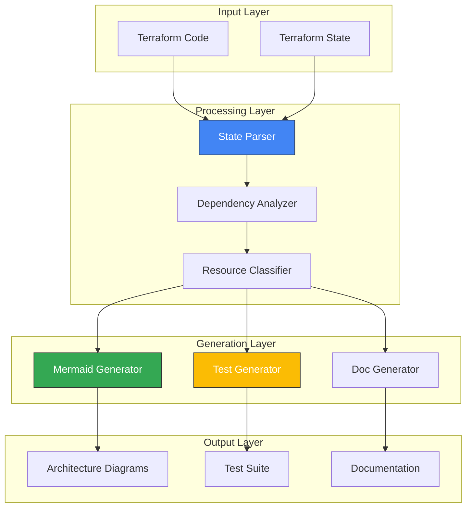
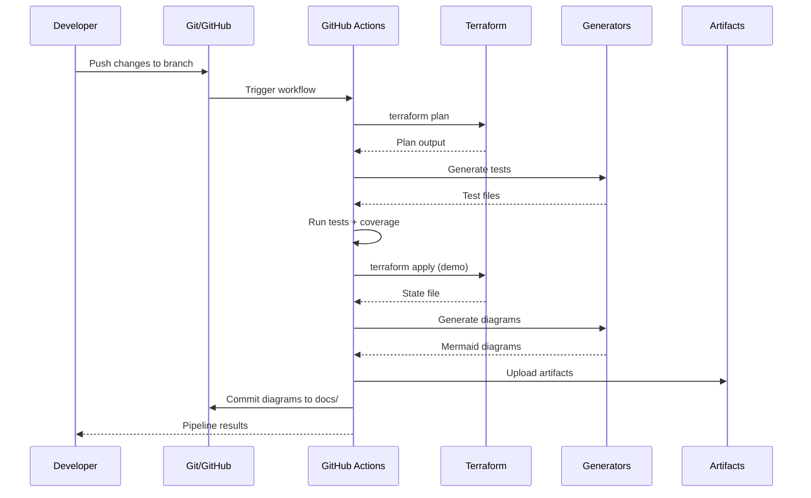

# Architecture Overview

## System Architecture

The IaC-to-Visual converter follows a modular pipeline architecture:



## Component Details

### 1. State Parser (`generate-diagram.py`)

**Purpose**: Extract structured data from Terraform state

**Responsibilities**:
- Parse JSON state file
- Extract resource definitions
- Build dependency graph
- Classify resources by type and category

**Input**: `terraform.tfstate` (JSON)
**Output**: Resource dictionary with dependencies

### 2. Diagram Generator (`MermaidGenerator` class)

**Purpose**: Convert infrastructure to visual diagrams

**Diagram Types**:
1. **Architecture Diagram**: Shows all resources grouped by category
2. **Network Topology**: Displays network relationships and data flow
3. **Data Flow**: Illustrates request/response patterns

**Features**:
- Resource categorization (Storage, Compute, Database, IAM, Monitoring)
- Dependency visualization
- Color-coded by category
- Icons for resource types
- Subgraph grouping

### 3. Test Generator (`generate-tests.py`)

**Purpose**: Automatically create test suites from Terraform code

**Test Types Generated**:
1. **Integration Tests**: Full stack deployment validation
2. **Resource Tests**: Per-resource-type validation
3. **Output Tests**: Verify stack outputs

**Features**:
- Parses `.tf` files for resource blocks
- Generates Terratest-compatible Go code
- Includes setup/teardown logic
- Parameterized for different environments

### 4. CI/CD Pipeline (`.github/workflows/terraform-to-visual.yml`)

**Purpose**: Orchestrate the complete IaC-to-Visual workflow

**Stages**:
1. Change detection (multi-stack support)
2. Terraform validation
3. Test generation and execution
4. Coverage enforcement
5. Infrastructure deployment (demo mode)
6. Diagram generation
7. Artifact publishing

**Artifacts**:
- Terraform plans
- Test results and coverage
- Architecture diagrams
- Combined pipeline results

## Data Flow

### Typical Workflow



## Technology Stack

### Core Technologies
- **Terraform**: Infrastructure as Code
- **Python 3.11+**: Diagram and test generation
- **Go 1.21+**: Test execution (Terratest)
- **Mermaid**: Diagram syntax
- **GitHub Actions**: CI/CD orchestration

### Key Libraries
- **Terratest**: Infrastructure testing framework
- **Python stdlib**: JSON parsing, file I/O
- **Go testing**: Test execution and coverage

## Security Considerations

### State File Handling
- State files may contain sensitive data
- Use remote backends (GCS, S3) with encryption
- Never commit state files to Git
- Use `.gitignore` to exclude sensitive files

### Credential Management
- Service account keys for CI/CD
- GitHub secrets for sensitive variables
- Terraform backend authentication
- Least-privilege IAM policies

### Generated Code Safety
- Test generation is read-only (no writes to infra)
- Generated tests run in isolated environments
- Diagram generation has no side effects
- All operations are deterministic

## Performance Characteristics

### Parser Performance
- **State Size**: Handles 50+ resources efficiently
- **Parse Time**: <1 second for typical stacks
- **Memory**: ~100MB for large states

### Test Generation
- **Generation Time**: <5 seconds per stack
- **Test Execution**: Depends on Terraform operations
- **Coverage Calculation**: <2 seconds

### Diagram Generation
- **Generation Time**: <3 seconds for all diagram types
- **File Size**: <50KB per diagram
- **Complexity**: Scales linearly with resource count

## Extensibility

### Adding New Diagram Types

1. Create new method in `MermaidGenerator`:
```python
def generate_security_diagram(self) -> str:
    # Custom diagram logic
    pass
```

2. Add to CLI options in `generate-diagram.py`

3. Update workflow to generate new type

### Adding New Resource Types

1. Update `Resource.category` property mapping
2. Add icon in `Resource.icon` property
3. Add color in `Resource.color` property
4. Update inference logic for relationships

### Adding New Test Types

1. Extend `TestGenerator._generate_test_functions()`
2. Add new test template method
3. Update test generation CLI options

## Future Enhancements (Phase 2)

### Planned Features
- **Visual-to-IaC**: Parse diagrams and generate Terraform
- **Multi-Cloud Support**: AWS, Azure, GCP
- **Intent Recognition**: Pattern matching to golden paths
- **Security Validation**: Pre-generation compliance checks
- **Interactive Refinement**: Web UI for diagram-to-code review
- **Golden Path Library**: Organization-specific templates

### Technical Improvements
- **Caching**: Speed up repeat diagram generation
- **Incremental Updates**: Only regenerate changed diagrams
- **Parallel Processing**: Process multiple stacks concurrently
- **Advanced Analysis**: Cost estimation, security scoring
- **Export Formats**: Lucidchart, Miro, draw.io, Excalidraw

---

**Version**: 1.0.0
**Last Updated**: 2025-10-16
**Maintained By**: Platform Engineering Team

