# online-banking Architecture

Auto-generated architecture diagrams from Terraform configuration.

## Architecture Overview

Complete infrastructure visualization showing all resources and their relationships.

```mermaid
graph TB

    subgraph Other
        google_project_service_required_apis[🔧 Required_Apis]
    end

    %% Dependencies

    %% Styling
    style google_project_service_required_apis fill:#607d8b,stroke:#333,color:#fff
```

## Network Topology

Network flow and connectivity between components.

## Data Flow

Data movement and processing paths through the system.

---

**Generated**: ${TIMESTAMP}  
**Stack**: online-banking  
**Workflow**: IaC to Visual Pipeline (AI-Enhanced)  
**Run**: 17  
**Commit**: 6c8bee047b418138aace35bb5fe4e1876d7a36f0
