# Online Banking Architecture

Auto-generated architecture diagrams from Terraform configuration.

**Generated**: October 17, 2025  
**Stack**: online-banking  
**Environment**: Development  
**Resources**: 23 total

---

## Architecture Overview

Complete infrastructure visualization showing all resources and their relationships across 5 major categories: Storage, Compute, Database, IAM, and Monitoring.

```mermaid
graph TB

    subgraph Other
        google_project_service_required_apis_cloudresourcemanager[🔧 Required_Apis]
        google_project_service_required_apis_compute[🔧 Required_Apis]
        google_project_service_required_apis_iam[🔧 Required_Apis]
        google_project_service_required_apis_run[🔧 Required_Apis]
        google_project_service_required_apis_sql_component[🔧 Required_Apis]
        google_project_service_required_apis_sqladmin[🔧 Required_Apis]
        google_project_service_required_apis_storage[🔧 Required_Apis]
        module_database_google_sql_user_banking_user[🔧 Banking_User]
        module_database_random_id_db_suffix[🔧 Db_Suffix]
        module_database_random_password_db_password[🔧 Db_Password]
        module_frontend_google_storage_bucket_object_index[🔧 Index]
    end

    subgraph Compute
        module_backend_google_cloud_run_service_api[🚀 Api]
    end

    subgraph IAM
        module_backend_google_cloud_run_service_iam_member_public_access[🔧 Public_Access]
        module_backend_google_project_iam_member_sql_client[🔧 Sql_Client]
        module_backend_google_service_account_backend[👤 Backend]
        module_frontend_google_storage_bucket_iam_member_public_read[🔧 Public_Read]
        module_storage_google_storage_bucket_iam_member_backend_access[🔧 Backend_Access]
    end

    subgraph Database
        module_database_google_sql_database_banking[💾 Banking<br/>banking]
        module_database_google_sql_database_instance_postgres[🗄️ Postgres]
    end

    subgraph Storage
        module_frontend_google_storage_bucket_frontend[📦 Frontend<br/>devops-sandbox-452616-dev-banking-frontend]
        module_storage_google_storage_bucket_documents[📦 Documents<br/>devops-sandbox-452616-dev-banking-docs]
    end

    subgraph Monitoring
        module_monitoring_google_logging_project_sink_banking_logs[📝 Banking_Logs]
        module_monitoring_google_monitoring_dashboard_banking_dashboard[📊 Banking_Dashboard]
    end

    %% Dependencies

    %% Styling
    style google_project_service_required_apis_cloudresourcemanager fill:#607d8b,stroke:#333,color:#fff
    style google_project_service_required_apis_compute fill:#607d8b,stroke:#333,color:#fff
    style google_project_service_required_apis_iam fill:#607d8b,stroke:#333,color:#fff
    style google_project_service_required_apis_run fill:#607d8b,stroke:#333,color:#fff
    style google_project_service_required_apis_sql_component fill:#607d8b,stroke:#333,color:#fff
    style google_project_service_required_apis_sqladmin fill:#607d8b,stroke:#333,color:#fff
    style google_project_service_required_apis_storage fill:#607d8b,stroke:#333,color:#fff
    style module_backend_google_cloud_run_service_api fill:#34a853,stroke:#333,color:#fff
    style module_backend_google_cloud_run_service_iam_member_public_access fill:#ea4335,stroke:#333,color:#fff
    style module_backend_google_project_iam_member_sql_client fill:#ea4335,stroke:#333,color:#fff
    style module_backend_google_service_account_backend fill:#ea4335,stroke:#333,color:#fff
    style module_database_google_sql_database_banking fill:#fbbc04,stroke:#333,color:#fff
    style module_database_google_sql_database_instance_postgres fill:#fbbc04,stroke:#333,color:#fff
    style module_database_google_sql_user_banking_user fill:#607d8b,stroke:#333,color:#fff
    style module_database_random_id_db_suffix fill:#607d8b,stroke:#333,color:#fff
    style module_database_random_password_db_password fill:#607d8b,stroke:#333,color:#fff
    style module_frontend_google_storage_bucket_frontend fill:#4285f4,stroke:#333,color:#fff
    style module_frontend_google_storage_bucket_iam_member_public_read fill:#ea4335,stroke:#333,color:#fff
    style module_frontend_google_storage_bucket_object_index fill:#607d8b,stroke:#333,color:#fff
    style module_monitoring_google_logging_project_sink_banking_logs fill:#9c27b0,stroke:#333,color:#fff
    style module_monitoring_google_monitoring_dashboard_banking_dashboard fill:#9c27b0,stroke:#333,color:#fff
    style module_storage_google_storage_bucket_documents fill:#4285f4,stroke:#333,color:#fff
    style module_storage_google_storage_bucket_iam_member_backend_access fill:#ea4335,stroke:#333,color:#fff
```

### Resource Breakdown

- **Storage**: 2 GCS buckets (frontend static site + document storage)
- **Compute**: 1 Cloud Run service (banking API)
- **Database**: 1 Cloud SQL PostgreSQL instance + 1 database
- **IAM**: 5 IAM bindings + 1 service account
- **Monitoring**: 1 dashboard + 1 log sink
- **Other**: 7 Google Cloud APIs + 4 supporting resources

---

## Network Topology

Network flow and connectivity between components, showing how traffic routes through the system.

### Network Flow

1. **Internet Traffic** → Cloud CDN/Load Balancer
2. **Frontend** (GCS Static Website) → Serves HTML/CSS/JS
3. **API Backend** (Cloud Run) → Processes business logic
4. **Database** (Cloud SQL) → Persistent data storage
5. **Document Storage** (GCS) → User file storage

---

## Data Flow

Data movement and processing paths through the system, including authentication, caching, and observability.

### Request Flow

1. **User** accesses the banking portal
2. **Frontend** serves static content from GCS
3. **API** receives requests and authenticates users
4. **Authentication** validates credentials
   - ✅ Valid → Process request
   - ❌ Invalid → Return error
5. **Database** stores and retrieves user data
6. **Cache** optimizes repeated queries
7. **Storage** manages user documents
8. **Logging** captures all activities
9. **Monitoring** tracks performance metrics

---

## Security Features

✅ **Identity & Access Management**
- Service accounts with minimal permissions
- IAM bindings for fine-grained access control
- Public read access only for frontend assets

✅ **Network Security**
- Uniform bucket-level access enabled
- Cloud SQL with authorized networks
- API authentication required

✅ **Data Protection**
- Database encryption at rest
- Automated backups enabled
- Password hashing and secure storage

✅ **Observability**
- Comprehensive logging for all operations
- Performance monitoring dashboards
- Query insights for database optimization

---

## Module Structure

The stack is organized into 5 modules for maintainability:

| Module | Purpose | Resources |
|--------|---------|-----------|
| **Frontend** | Static website hosting | GCS bucket, IAM, index.html |
| **Backend** | API services | Cloud Run, service account, IAM |
| **Database** | Data persistence | Cloud SQL, database, user, passwords |
| **Storage** | Document management | GCS bucket, lifecycle policies, IAM |
| **Monitoring** | Observability | Logging sink, monitoring dashboard |

---

## Cost Optimization

💰 **Storage Lifecycle**
- Documents auto-tier to NEARLINE after 90 days
- Further tier to COLDLINE after 365 days
- Reduces storage costs by ~50-70% over time

💰 **Compute**
- Cloud Run auto-scales from 0 to N instances
- Pay only for actual usage
- No idle costs

💰 **Database**
- db-f1-micro tier for development (~$10/month)
- Automated backups without point-in-time recovery (dev)
- Can scale up for production

**Estimated Monthly Cost (Dev)**: $50-100

---

## Deployment Information

**Project ID**: devops-sandbox-452616  
**Region**: us-central1  
**Environment**: dev  
**Terraform Version**: 1.12.2  
**Last Updated**: October 17, 2025

---

**Generated by**: IaC-to-Visual Pipeline  
**Workflow**: GitHub Actions CI/CD  
**Source**: [terraform-gcs-poc](https://github.com/intuitivetp/terraform-gcs-poc)
